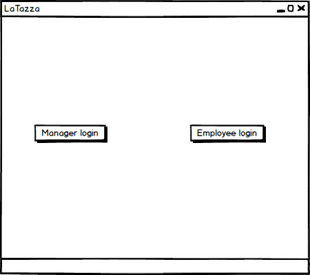
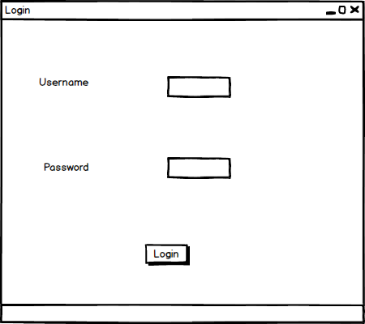
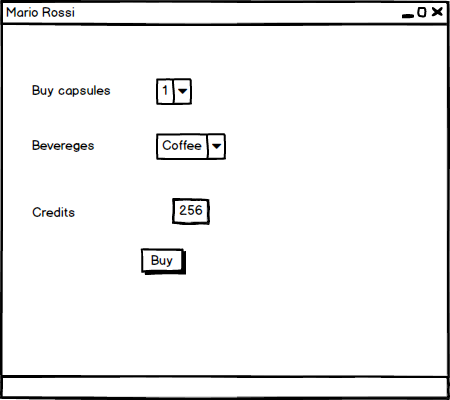
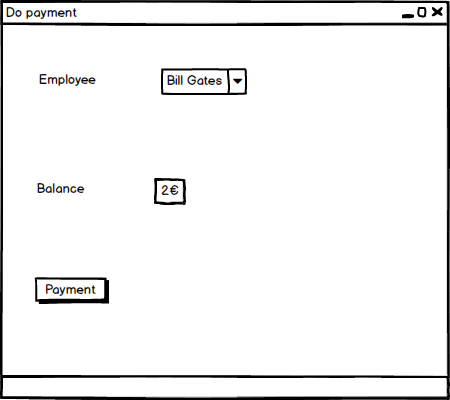
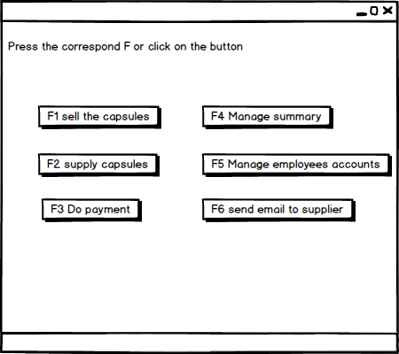
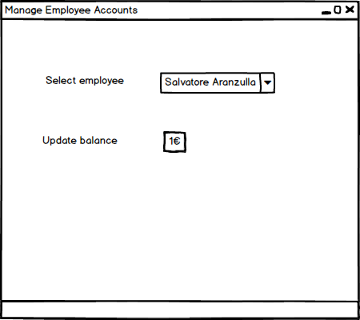
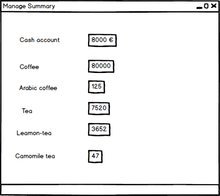
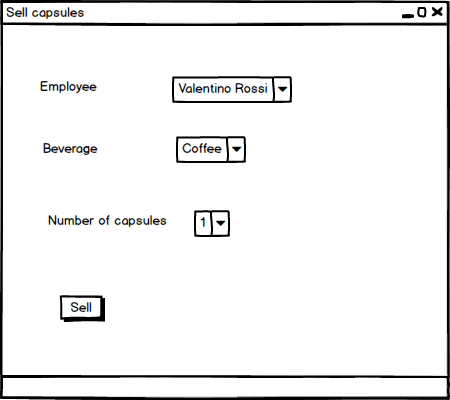
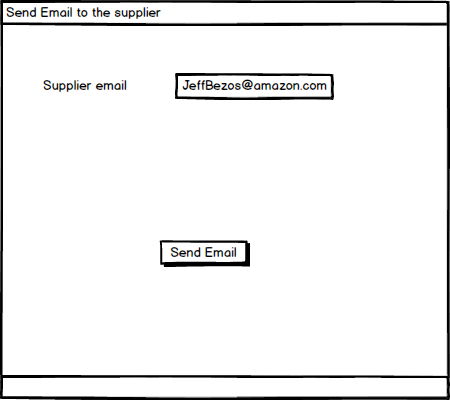
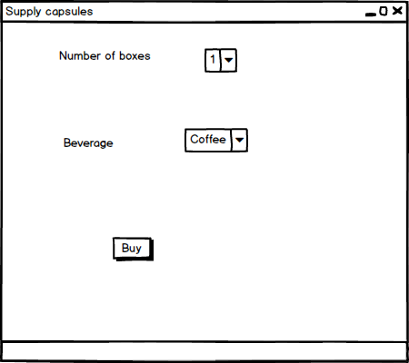

### GUI Sketch 

*Figure 1: First window*

*Figure 2: Login window*

*Figure 3: Employee window*

*Figure 4: Payment window for manager*

*Figure 5:  Manager main menu*

*Figure 6:  Manage employee account*

*Note: The new value of the balance can be inserted in the field on the right side of update balance*

*Figure 7:  Manage Summary*

*Figure 8:  Sell Capsules*

*Figure 9:  Send email to the supplier*

*Figure 10:  Supply capsules*
