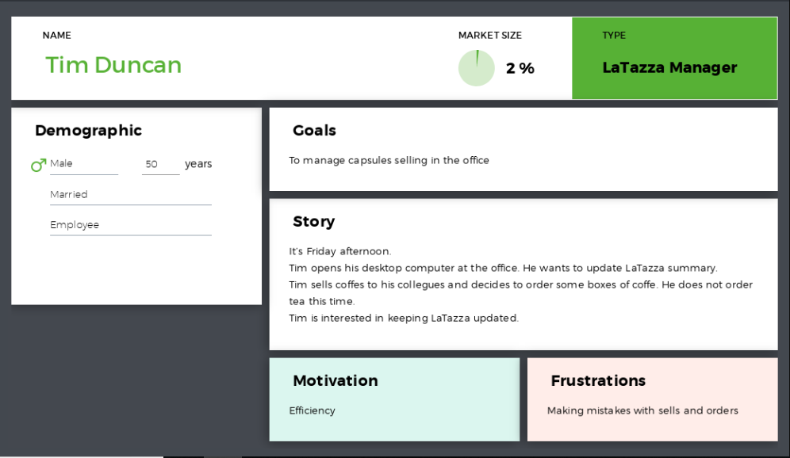

# Requirements Document Template

Authors: Angione Francesco, Butera Alberto, Di Fabio Matteo, Forese Leonardo

Date: 04/04/2019

Version: 0.89
# Contents

- [Stakeholders](#stakeholders)
- [Context Diagram and interfaces](#context-diagram-and-interfaces)
	+ [Context Diagram](#context-diagram)
	+ [Interfaces](#interfaces) 
	
- [Stories and personas](#stories-and-personas)
- [Functional and non functional requirements](#functional-and-non-functional-requirements)
	+ [Functional Requirements](#functional-requirements)
	+ [Non functional requirements](#non-functional-requirements)
- [Use case diagram and use cases](#use-case-diagram-and-use-cases)
	+ [Use case diagram](#use-case-diagram)
	+ [Use cases](#use-cases)
	+ [Relevant scenarios](#relevant-scenarios)
- [Glossary](#glossary)
- [System design](#system-design)

# Stakeholders


| Stakeholder name  | Description | 
| ----------------- |:-----------:|
|Manager| Employee who administrates LaTazza system |
|Employeee| Simple employee who buyes capsules through his local account|   
|Visitor| Person who visits the Company and can buy capsules only by cash|
|Supplier| Entity which supplies and deliveries boxes of capsules needed| 
|Developer| The person who mades the application|
|Email System| System which is required to order capsules to the supplier|

# Context Diagram and interfaces

## Context Diagram


*Figure 1: Context Diagram*


*Note: The Manager is an Employee*


## Interfaces
| Actor | Logical Interface | Physical Interface  |
| ------------- |:-------------:| :-----:|
| Manager   | LaTazza GUI desktop application  | Screen, Keyboard, Clients  |
| Employee| LaTazza GUI desktop application | Manager , Screen, Keyboard|
| Visitor |  | Manager |
| Supplier | Email System | |
|Email System | POP, IMAP, SMTP |  |

*Note: There is a previous agreement between the supplier and the manager for which at that specific email address him/her will receive only order request of capsules created by the LaTazza system and suitable for its own system in order to make the preparation and delivery of the order correct.*
# Stories and personas


*Figure 1: persona 1*


*Figure 2: persona 2*


*Figure 3: persona 3*


# Functional and non functional requirements

## Functional Requirements

| ID        | Description  |
| ------------- |:-------------:| 
|  FR1     |   Handle sale transaction  |
|  FR2     |   Order boxes  |
|  FR3    |  Sell capsules  |
|  FR4     |  Send email to supplier  |
|  FR5     |  Select employee  |
|  FR6     |  Sell credits  |


## Non Functional Requirements


| ID        | Type (Efficiency, Reliability, Usability, Portability, Delivery etc.)           | Description  | Refers to |
| ------------- |:-------------:| :-----:| -----:|
|  NFR1     | Efficiency   |  The time required to the manager for selling a capsules to the buyers should be at most 2 minutes  | FR1|
|  NFR2     | Delivery  | Delivery of the capsules shuold be done immediately | FR3|
|  NFR3     | Reliability  | Capsules are delivered to the correct buyer | FR3|
| NFR4 | Privacy | Sensible information about employee must be encrypted   | FR5 |
| NFR5 | Portability | The desktop application is written in Java for allowing execution in different Operating Systems | -|
| NFR6 | Reliability |  Trasactions using credits shall be rolled back in case of errors during the acquisition | FR6 |
|NFR7 | Reliability   | The correct order request has to be generated, with correct number of boxes, in a textual description file |  FR2|
| NFR8 | Reliability | The textual description of the order has to be converted into an email format and sent to the correct supplier |  FR4|
| NFR9 | Reliability | The number of avialable capsules cannot be negative, neither the cash account | - | 


Note: The meaning of the word buyer can be both the employee or the visitor

# Use case diagram and use cases


## Use case diagram
```plantuml


left to right direction

actor Manager as m
actor Employee as e
actor Visitor as v
actor Supplier as s
actor Emailsystem as ma

e <|-- m

m <-- (Handle sale transaction)
m --> (Order boxes)
m <-- (Sell credits)
e --> (Sell capsules)
e --> (Sell credits)
v --> (Sell capsules)
s <-- (send email to supplier)
ma <-- (send email to supplier)

(Sell capsules) <. (Select employee) :extend

(Handle sale transaction) .> (Sell capsules) :include


(Sell credits) .> (Select employee) :include
  
(Order boxes)  .> (send email to supplier): include


```


## Use Cases

### Use case 1, UC1
| Actors Involved       | Employee, Manager |
| ------------- |:-------------:| 
|  Precondition     | The employee wants a coffee  |  
|  Post condition     | The Employee has bought a capsule of coffee |
|  Nominal Scenario     | The employees goes to the manager for getting the capsule, paying it with credits or cash money |
|  Variants     | The capsules of that specific type are finished, the employee has to decide between gettin another thing or not. |

Note: an employee can always buy a caspsule even if its own credit is negative.

### Use case 2, UC2
| Actors Involved       | Visitor, Manager |
| ------------- |:-------------:| 
|  Precondition     | The visitor wants a coffee  |  
|  Post condition     | The visitor has bought a capsule of coffee |
|  Nominal Scenario     | The visitor goes to the manager for getting the capsule, paying it with cash money |
|  Variants     | The capsules of that specific tyoe are finished, the visitor has to decide between gettin another thing or not. |


### Use case 3, UC3
| Actors Involved       | Supplier, Manager |
| ------------- |:-------------:| 
|  Precondition     | The manager has to make an order of specific capsules  |  
|  Post condition     | The manager receives the order confirmation email |
|  Nominal Scenario     | The manager open the LaTazza desktop application in order to select the correct number and type of needed boxes of capsules to be ordered, then clicking on buy it will send the order via email to the supplier, paying it to the delivery with cash money  |
|  Variants     | The order confirmation email does not arrive, the manager has to redo the order. 	The supplier has not avialable the given boc of capsules, an email is sent to the manager |

### Use case 4, UC4
| Actors Involved       | Employee, Manager |
| ------------- |:-------------:| 
|  Precondition     | The employee wants to acquire credits |  
|  Post condition     | The employee's balance is updated with the new value |
|  Nominal Scenario     | The employees goes to the manager for acquiring credits, paying them with cash money|
|  Variants     | The updte of the balance goes wrong, the manager has to redo the update operation |


# Relevant scenarios

## Scenario 1

| Scenario ID: SC1        | Corresponds to UC: UC1 |
| ------------- |:-------------:| 
| Step#        | Description  |
|  1    | An Employee would to buy some capsules |  
|  2    | Check in his local account if he have some credits |
|  3    | If he don't have credits go to the manager and buy credits |
|  4    | The manager loads the credits to the local account of the Employee|
|  5    | The Employee buys the capluses|

## Scenario 2

| Scenario ID: SC1        | Corresponds to UC: UC2 |
| ------------- |:-------------:| 
| Step#        | Description  |
|  1    | A Visitors would buy some capsules |  
|  2    | Visitor goes to the manager |
|  3    | Visitor pays with cash the capsules |
|  4    | The manager takes the money and update the cash summary|

## Scenario 3
| Scenario ID: SC1        | Corresponds to UC: UC3 |
| ------------- |:-------------:| 
| Step#        | Description  |
|  1    | The manager wants to make an order|  
|  2    | The Manager opens the LaTazza app Dekstop |
|  3    | The Manager makes the order with the GUI|
|  4    | The app automatically sends and email to the Supplier with the requested products|
|  5    | The Manager checks if the order confirmation email has arrived|

Note: the payment of the order is done at the delivery of the boxes.

## Scenario 4
| Scenario ID: SC1        | Corresponds to UC: UC4 |
| ------------- |:-------------:| 
| Step#        | Description  |
|  1    | The Employee goes to the manager  |  
|  2    | The Employee pays with cash the credits who wants |
|  3    | The Manager updates the Employee's balance |

## Scenario 5
| Scenario ID: SC1        | Corresponds to UC: UC4 wrong |
| ------------- |:-------------:| 
| Step#        | Description  |
|  1    | The Employee goes to the manager  |  
|  2    | The Employee pays with cash the credits who wants |
|  3    | The Manager updates the Employee's balance |
|  4    | The Manager checks if the update has gone in the right way|
|  5    | The system returns an error on the update|
|  6    | The Manager re-update the Employee's account(repeat again UC4)|

# Glossary


*Figure 3: UML Class Diagram*

# System Design


*Figure 4: System Design UML Class Diagram*
