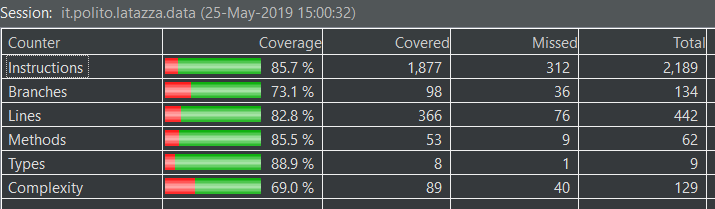
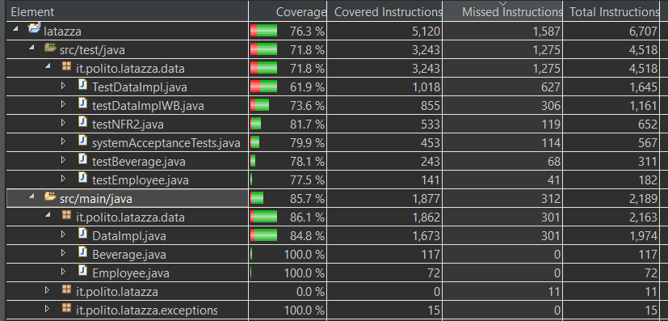

# Unit Testing Documentation template

Authors: Angione Francesco, Butera Alberto, Di Fabio Matteo, Forese Leonardo

Date: 10/05/2019

Version: 1.0.0

# Contents

- [Black Box Unit Tests](#black-box-unit-tests)

- [White Box Unit Tests](#white-box-unit-tests)

# Black Box Unit Tests

 ### **Class *Employee* - method *setName(String)/ String getName()***
 *Same for setSurname(String) / String getSurname()*
 *Same for the methods of class Beverage: String getName()/setName(String)*

**Criteria:**
For both input and output the string must be well formed, the length does not cause problems.

**Predicates:**

| Criteria | Predicate |
| -------- | --------- |
|    String well formed     |     yes      |
| | no | 

**Boundaries**:

| Criteria | Boundary values |
| -------- | --------------- |
| String well formed         |   Empty string    |

**Combination of predicates**:

| Criteria |  Valid / Invalid | Description of the test case | JUnit test case |
|------- | -------|-------|-------|
| String well formed | yes | String="aname" |  test1String() | 
|  | no | String="12#" | test2String() | 

 ### **Class *Employee/Beverage* - method *int getID()**
*considerations are valid also for setOldRemainingCap(int),getOldRemainingCap(),getNewRemainingCap(),setNewRemainingCap(int),int GetRemainingCapsules(), setRemainingCapsules(int), setCapsulesPerBox(int), int getCapsulesPerBpx() from Beverage class*

**Criteria:**
C1: Sign of number
C2: Range of number 

**Predicates:**

| Criteria | Predicate |
| -------- | --------- |
|    Sign of Number   |     Positive ( including zero  )       |
| | negative |
| Range of number |     inside: −2,147,483,648>=  and <=2,147,483,647  |  
| |  outside the range: −2,147,483,648<  or >2,147,483,647 |

**Boundaries**:

| Criteria | Boundary values |
| -------- | --------------- |
| Range of number   |   max int    |
| | min int  | 

**Combination of predicates**:

| C1| C2| Valid / Invalid | Description of the test case | JUnit test case |
|------- | -------| -------|-------|-------|
| positive| inside | valid | 35 | test1Int() |
| positive | outside | invalid | 2,147,483,648  | test2Int() |
| negative | inside | invalid | -35 | test3Int() | 
| negative | outside | invalid | −2,147,483,649 | test4Int() | 

 ### **Class *Employee* - method *float getBalance()/ setBalance ( float) **
*Considerations are also valid for float getPrice(), setPrice(float), float getBoxPrice(), setBoxPrice(float), getNewPrice(), setNewPrice(float)*

**Criteria:**
C1: Sign of number
C2: Range of number 

**Predicates:**

| Criteria | Predicate |
| -------- | --------- |
|    Sign of Number   |     Positive ( including zero  )       |
| | negative |
| Range of number  |   inside:  1.4E-45>= and <=3.4028235E38 |  
|  | outside the range:  1.4E-45< and >3.4028235E38 |

**Boundaries**:

| Criteria | Boundary values |
| -------- | --------------- |
| Range of number   |   max int    |
| | min int  | 

**Combination of predicates**:

| C1| C2| Valid / Invalid | Description of the test case | JUnit test case |
|------- | -------| -------|-------|-------|
| positive| inside | valid | 3.5 | test1Float() |
| positive | outside | invalid | 3.4028235E38  | test2Float() |
| negative | inside | valid | -0.5 | test3Float() | 
| negative | outside | invalid | −1.4E-45 | test4Float() | 

 ### **Class *DataImpl* - method * int getBeverageCapsules(int id)**

**Criteria:** 
C1: Sign of number
C2: Range of number 

**Predicates:**

| Criteria | Predicate |
| -------- | --------- |
|    Sign of Number   |     Positive ( including zero  )       |
| | negative |
| Range of number   |   inside: −2,147,483,648>=  and <=2,147,483,647  |  
| |  outside the range: −2,147,483,648<  or >2,147,483,647 |

**Boundaries**:

| Criteria | Boundary values |
| -------- | --------------- |
| Range of number   |   max int    |
| | min int ( in our case is zero) | 

**Combination of predicates**:

| C1| C2| Valid / Invalid | Description of the test case | JUnit test case | JUnit test class | 
|------- | ------- |  -------| -------|-------|-------|
| positive| inside | valid | 35 | testGetBeverageCapsules1() | testDataImpl |
| positive | inside | invalid | 0 | testGetBeverageCapsules2() | testDataImpl |
| positive | inside | valid | 2 147 483 647 | testGetBeverageCapsules3() |testDataImpl |
| positive | outside | invalid | 2 147 483 647  | testGetBeverageCapsules4() |testDataImpl |
| negative | inside | invalid | -35 | testGetBeverageCapsules5() | testDataImpl |
| negative | inside | invalid | −2 147 483 647 | testGetBeverageCapsules6() | testDataImpl |

 ### **Class *DataImpl* - method *updateBeverage(int id, string name, int capsulesPerBox, int boxPrice)***

**Criteria:**
C1: Sign of number
C2: Range of number 
C3: String is well formed, the length does not cause problems 

**Predicates:**

| Criteria | Predicate |
| -------- | --------- |
|    Sign of Number   |     Positive ( including zero  )       |
| | negative |
| Range of number  |   inside: −2,147,483,648>=  and <=2,147,483,647  |  
|  | outside the range: −2,147,483,648<  or >2,147,483,647 |
| String is well formed | yes |
| | no| 

**Boundaries**:

| Criteria | Boundary values |
| -------- | --------------- |
| Range of number   |   max int    |
| | min int ( in our case is zero) |
| string | empty string | 

| C1| C2| C3 |  Valid / Invalid | Description of the test case | JUnit test case | JUnit test class | 
|------- | ------- |  -------| -------|-------|-------| -------| 
| positive| inside | yes |valid | 35, "Mario" , 50 , 100 | testUpdateBeverage1() | testDataImpl |
| positive| inside | no |invalid | 35, "32#" , 50 , 100 | testUpdateBeverage2() | testDataImpl |
| positive | inside | yes| valid | 0, "Mario" , 50 , 100 | testUpdateBeverage3() | testDataImpl |
| positive | inside | empty string| valid | 35, "" , 50 , 100 | testUpdateBeverage4() | testDataImpl |
| positive | inside | yes| valid | 2 147 483 647, "Mario" , 50 , 100 | testUpdateBeverage5() |testDataImpl |
| positive | inside | no| invalid | 2 147 483 647, "M62" , 50 , 100 | testUpdateBeverage6() |testDataImpl |
| positive | outside | yes|invalid | 35,"Mario", 2 147 483 648,100  | testUpdateBeverage7() |testDataImpl |
| positive | outside | no|invalid | 35,"!£&(", 2 147 483 648,100 | testUpdateBeverage8() |testDataImpl |
| negative | inside | yes|invalid | -35, "Mario", 50,100 | testUpdateBeverage9() | testDataImpl |
| negative | inside | no  |invalid | -35,  "312", 50,100  | testUpdateBeverage10() | testDataImpl |
| negative | outside | yes |invalid | −2 147 483 649,  "Mario", 50,100  | testUpdateBeverage11() | testDataImpl |
| negative | outside | no  |invalid | −2 147 483 649,  "65", 50,100  | testUpdateBeverage12() | testDataImpl |

### **Class *DataImpl* - method *int createBeverage(String name, int  capsulesPerBox, int boxPrice)***
The criteria for the inputs value are exactly the same of the previous one, moreover the returned value must be consistend i.e. it should be a positive integer.

JUnit test cases are included in the testUpdateBeverage-i with i from 1 to 12. ( see updateBeverage Black Box tests)

### **Class *DataImpl* - method * buyBoxes(int beverageId, int boxQuantity)***
**Criteria:** 
C1: Sign of number
C2: Range of number 

**Predicates:**

| Criteria | Predicate |
| -------- | --------- |
|    Sign of Number   |     Positive ( including zero  )       |
| | negative |
| Range of number   |   inside: −2,147,483,648>=  and <=2,147,483,647  |  
| |  outside the range: −2,147,483,648<  or >2,147,483,647 |

**Boundaries**:

| Criteria | Boundary values |
| -------- | --------------- |
| Range of number   |   max int    |
| | min int ( in our case is zero) | 

**Combination of predicates**:

| C1| C2| Valid / Invalid | Description of the test case | JUnit test case | JUnit test class | 
|------- | ------- |  -------| -------|-------|-------| 
| positive| inside | valid | 35, 5 | testGetBeverageCapsules1() | testDataImpl |
| positive | inside | valid | 2,0 | testGetBeverageCapsules2() | testDataImpl |
| positive | inside | valid | 2 147 483 647, 5 | testGetBeverageCapsules3() |testDataImpl |
| positive | outside | invalid | 2 147 483 648 , 5  | testGetBeverageCapsules4() |testDataImpl |
| negative | inside | invalid | -35 ,5| testGetBeverageCapsules5() | testDataImpl |
| negative | outside | invalid |  5, −2 147 483 648 | testGetBeverageCapsules5() | testDataImpl |

### **Class *DataImpl* - method *int rechargeAccount(ind id, int amountInCents)***
The criteria for the inputs value are exactly the same of the previous one, moreover the amount of recharge must be consistend i.e. it should be a positive integer.

JUnit test cases are testRechargeAccount-i() with i from 1 to 5, except for the value outside the range. ( see buyBoxes Black Box tests) 

### **Class *DataImpl* - method *int sellCapsules(int employeeId, int beverageId, int numberOfCapsules, Boolean fromAccount)***

**Criteria:** 
On both input and output values:
C1: Sign of number
C2: Range of number 
On input value:
C3: boolean value should be correct ( i.e. zero or one )

**Predicates:**

| Criteria | Predicate |
| -------- | --------- |
|    Sign of Number   |     Positive ( including zero  )       |
| | negative |
| Range of number |   inside: −2,147,483,648>=  and <=2,147,483,647  |  
| |  outside the range: −2,147,483,648<  or >2,147,483,647 |
| Boolean value is true | yes | 
| | no | 
*Note: the boolean value must be only true or false otherwise there is a compilation error (it's impossible to compile the code)*

**Boundaries**:

| Criteria | Boundary values |
| -------- | --------------- |
| Range of number   |   max int    |
| | min int ( in our case is zero) | 

**Combination of predicates**:

| C1| C2| C3 |  Valid / Invalid | Description of the test case | JUnit test case | JUnit test class | 
|------- | ------- |  -------| -------|-------|-------| -------| 
| positive | inside | yes | valid | 35,12,2,true    | testSellCapsules1() | testDataImpl |
| positive | inside  | no |  valid | 35,12,2,false | testSellCapsules2() | testDataImpl |
| positive | outside | yes |  invalid | 12,2,2 147 483 648,true  | testSellCapsules3() | testDataImpl |
| positive | outside | no | invalid |  35,2,2 147 483 648,false | testSellCapsules4() | testDataImpl |
| negative | inside | yes |  invalid | 12,2,-35,true  | testSellCapsules5() | testDataImpl |
| negative | inside | no | invalid | 12,2,-35,false | testSellCapsules6() | testDataImpl |
| negative | outside | yes | invalid | 12,2,-2 147 483 649,true | testSellCapsules7() | testDataImpl |
| negative | outside | no |  invalid | 12,2,-2 147 483 649,false  | testSellCapsules8() | testDataImpl |

*Note 1: The following methods of the class DataImpl will not be tested since they are based on external library or have been olready tested in the other test suites which should be already tested and without errors: List<> getEmployeesId(), int getEmployeeBalance(int), List<> getBeveragesId(), int getBeverageBoxPrice(int), int getBeverageCapsulesPerBox(int), string getBeverageName(int), string getEmployeeSurname(int), string getEmployeeName(int).*

*Note 2: Regarding the methods List<> getReport(date,date) and List<> getEmployeeReport(int,date,date) it is assumed that the code for parsing the result set of the query is standard, therefore it should be correct (with the right query for obtaining the results).*

# White Box Unit Tests

### Test cases definition

The whithe box tests will be done only for the class DataImpl since the others classes are too simple and mostly of them heve methods with a single line of code.

| Unit name - function | JUnit test case |JUnit test class |
|--|--| -- | 
|DataImpl - int getBalance()| testGetBalance()| testDataImplWB | 
|DataImpl - updateEmployee(int, string, string)|testUpdateEmployee()| testDataImplWB |
| DataImpl - int createEmployee(string, string)| testCreateEmployee() | testDataImplWB |
| DataImpl - sellCapsulesToVisitors(int, int) | testSellCapsulesToVisitors() | testDataImplWB | 
| DataImpl - List<String>getReport(date, date) | testGetReport() | testDataImplWB | 
| DataImpl - List<String>getEmployeeReport(int, date, date) | testGetEmployeeReport() | testDataImplWB | 
| Beverage - swap(), isNewValuesset(),setFlagNewPrice() | testSwapBoolean() | TestBeverage | 
| DataImpl - sellCapsulesToVisitors(int, int)|  testSellCapsulesToVisitorsNewPrice |  testDataImplWB |
| DataImpl - 	public Integer sellCapsules(int , int ,int , Boolean )|  testSellCapsulesNewPrice |  testDataImplWB |

*Note: the tests on the getReport and getEmployeeReport will not test the seconds of the timestamp in order to be system-load independent.*

### Code coverage report

 

*Figure 1:Coverage by Jacoco Tool*

 

*Figure 2: Class Coverage by Jacoco Tool*

### Loop coverage analysis

|Unit name - function | Loop rows | Number of iterations | JUnit test case - JUnit test class |
|---|---|---|---|
|DataImpl - Map<> getEmployees()|1|0|testLoopCoverage1 - testDataImplWB|
|DataImpl - Map<> getEmployees()|1|5|testLoopCoverage2 - testDataImplWB|
|DataImpl - Map<> getBeverages()|1|0|testLoopCoverage3 - testDataImplWB|
|DataImpl - Map<> getBeverages()|1|1|testLoopCoverage4 - testDataImplWB|
|DataImpl - Map<> getBeverages()|1|5|testLoopCoverage5 - testDataImplWB|

