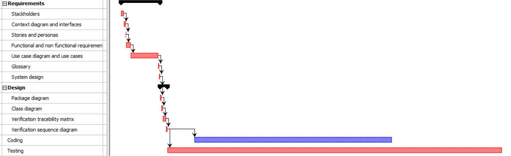
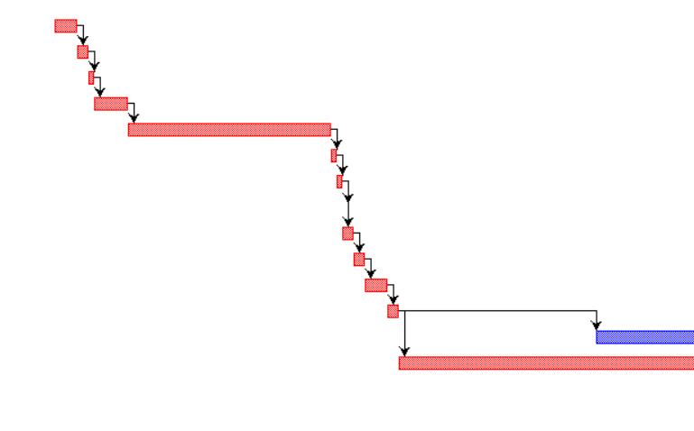

# Project Estimation  template

Authors: Angione Francesco, Butera Alberto, Di Fabio Matteo, Forese Leonardo

Date: 28/05/2019

Version: 1.1.0

# Contents

- [Data from your LaTazza project](#data-from-your-latazza-project)

- [Estimate by product decomposition](#estimate-by-product-decomposition)
- [Estimate by activity decomposition ](#estimate-by-activity-decomposition)

# Data from your LaTazza project

###

|         Total person days worked by your  team, considering period March 5 to May 26 (1 person day == 8 person hours)     | 24  |             
| ----------- | ------------------------------- | 
|Total Java LoC delivered on May 26 (only code, no Junit code) | 116+ 717+ 98|
| Total number of Java classes delivered on May 26 (only code, no Junit code)| 3 |
| Productivity P =| 4.84 |
|Average size of Java class A = | 310 |

# Estimate by product decomposition

### 

|             | Estimate                        |             
| ----------- | ------------------------------- |  
| Estimated n classes   |                3             |             
| Estimated LOC per class  (Here use Average A computed above )      |     310                       |                
| Estimated effort  (person days) (Here use productivity P)  |           7.75                           |      
| Estimated calendar time (calendar weeks) (Assume team of 4 people, 8 hours per day, 5 days per week ) |        3        |       

# Estimate by activity decomposition

### 

|         Activity name    | Estimated effort    |             
| ----------- | ------------------------------- | 
|Requirements: | 10.5 hours |
| -Stackholders| 2 hours | 
| - Context diagram and interfaces | 1 hour| 
| - Stories and personas | 0.5 hour | 
| - Functional and non functional requirements | 2 hours | 
| - Use case diagram and use cases | 3 hours| 
| - Glossary | 0.5 hour| 
| - System design | 0.5 hour| 
| Design: | 4 hours |
| -Package diagram| 1 hour | 
| -Class diagram | 1 hour  |
| -Verification tracebility matrix | 1 hour | 
| -Verification sequence diagram | 1 hour | 
| Coding | 40 hours |
| Testing | 55 hours  | 

*Note1: hours are cosindered for a team of four people for Requirements and Design.*

*Note2: The group of four people will be divided in two small groups composed of two person, one groupo will be in charge of the coding and the other of testing.*

# Gantt Chart

 

*Figure 1:Global Gantt Chart of the project*

*Figure 2:Detail of Gantt Chart for the Requirements and Design*
